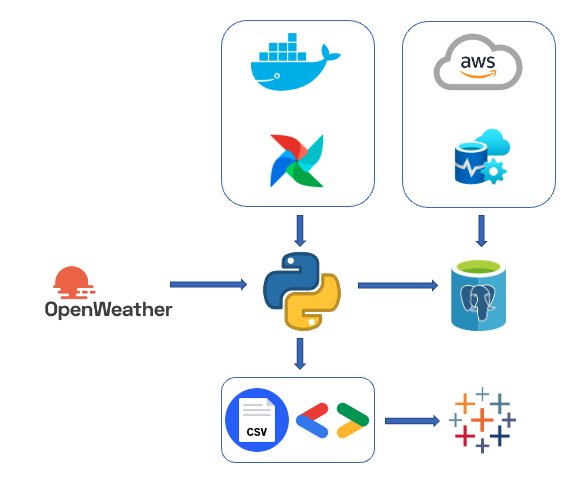
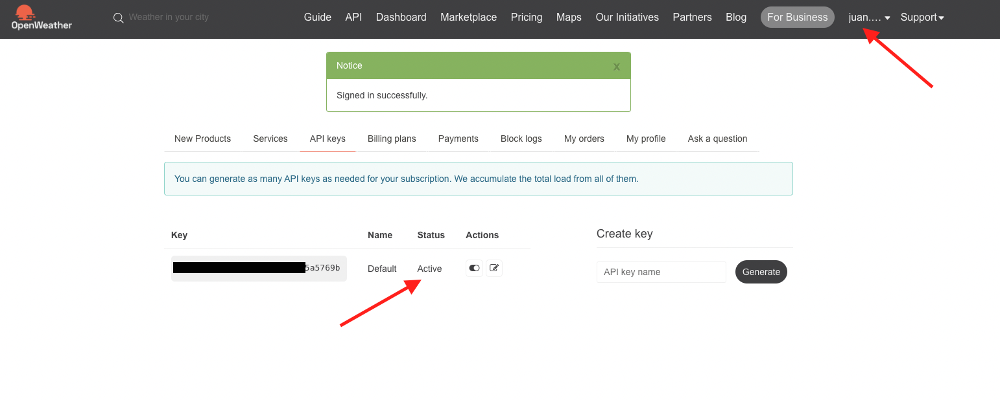
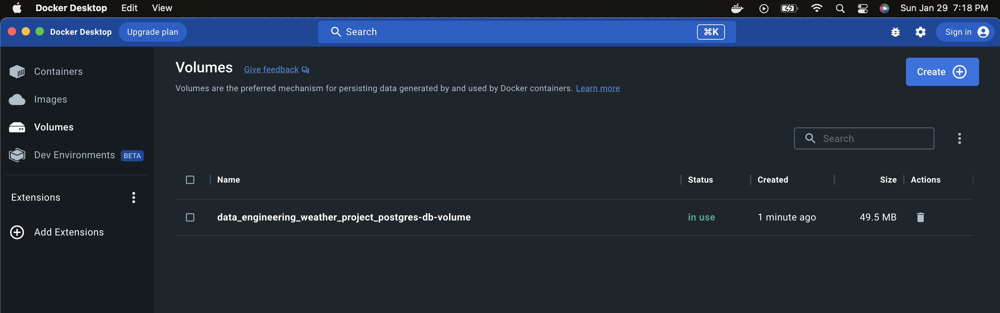
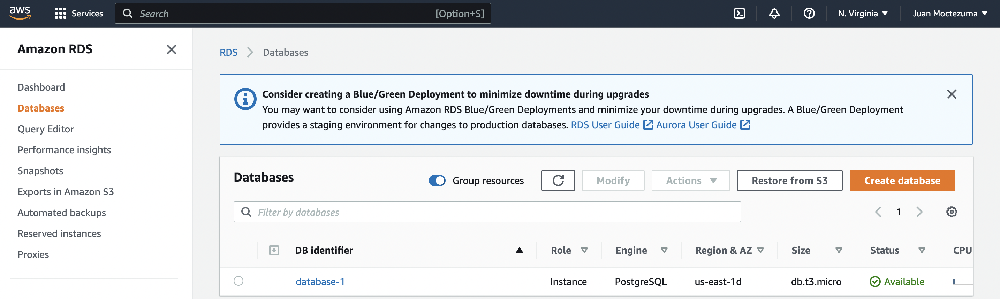
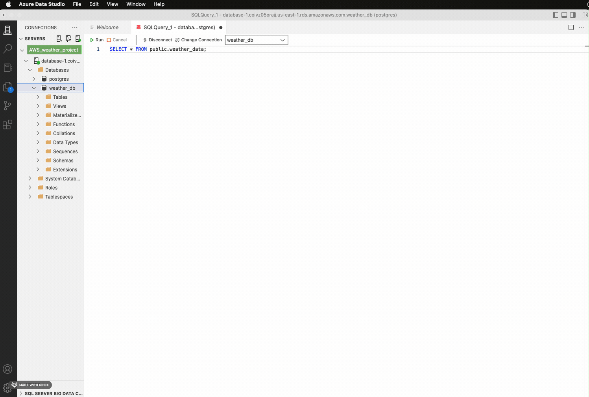
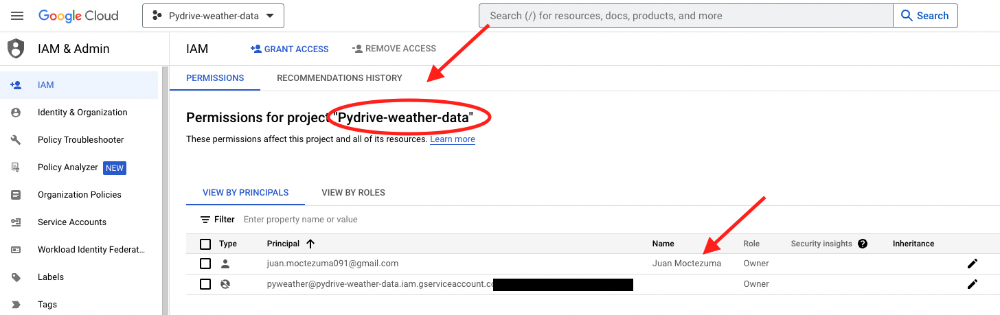
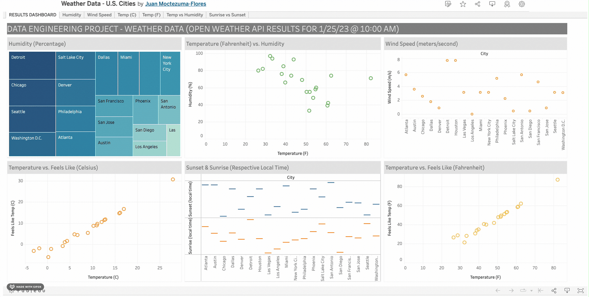

# Weather Data Engineering Project

### Technical Description in Non-Technical Terms
The purpose of this data project is to demonstrate how weather data from multiple cities in the U.S. gets extracted or fetched from *OpenWeather*, an open source (specifically an API - Application Programming Interface). Then it gets transformed or converted into the correct format, and finally loaded into a Postgre SQL database and into a Google Sheet (required step for data visualization with Tableau). The "Extraction Transforming & Loading" (ETL) process mentioned previously was completed with Python programming language across multiple scripts or files. However, additional processes include the automation of workflow (with Apache Airflow), and the use of several external technologies such as Amazon Web Services (AWS), Azure Data Studio, Docker & Google Developement software (credentials). 

### Diagram For Technologies Involved

### Diagram Explanation: 
1. Raw data flows from the OpenWeather API (free-source) - Account is required to request an API 'Key'
2. Data gets modified and recorded through the ETL pipeline written in Python - which is automated by Apache Airflow (Docker dependant)
   - ETL gets automated as it runs in a given timeframe
   - As part of the automation project, a 'Delete' script erases old weather data (at database) and updates CSV file (see *Data* folder)
3. Data ends up in two places:
   - Info. gets stored in a database - which is set up by Amazon Web Services (AWS) and uses Azure Data Studio (Graphical User Interface to run queries)
   - Info. gets iterated into a Google Sheet (Google Developers' credentials required), which gets connected to Tableau Public (Data Visualization tool)
  
### How Was this Built? - Visual Representation
### Part 1 - Active API Key was obtained from *OpenWeather*

### Part 2 - Docker & Airflow were installed

### Part 3 - Four different Python scripts were written:

1. Weather_etl - Main script containing the pipeline and generates CSV file
2. Data_delete - script that deletes old data from the database 
3. Weather_dag - automation code which runs the 2 previous scripts
4. Google_drive_upload - script that loads data from local computer into Google Drive

### Part 4 - AWS free tier account was created - Database credentials were generated

### Part 5 - Azure Data Studio was downloaded to verify the loaded results

### Part 6 - Google credentials were created and downloaded as .JSON files

### Part 7 - Results were manually compiled into a dashboard

Click the following to see the dashboard: https://public.tableau.com/app/profile/juan.moctezuma.flores/viz/WeatherData-U_S_Cities/RESULTSDASHBOARD

### Technologies
1. Airflow - Workflow Management Platform
2. Cloud Technologies/Tools:
   - Amazon Web Services - free tier version
   - Docker
3. Database Tools:
   - Azure Data Studio
   - PostgreSQL (language or syntax)
4. Google Developer Console:
   - OAuth 2.0 Client credential
   - Service Account credential
5. Google Sheet
6. Python 3 (plus libraries) language
7. Visual Studio Code (Main Programming Tool)
8. Tableau Public (data visualization tool)

### Outcomes
1. Data integration - Real world 'ETL' processes applied
2. Data Management - Planning the flow of data (& the required tools or technologies) and basic data architecture
3. Dashboard - Visual representation of real-time weather results ('snapshot') provided by the author's code
4. Programming - Python 3 (language used to build and compile the rest of the tools) & PostgreSQL (for database design and results' verification)
